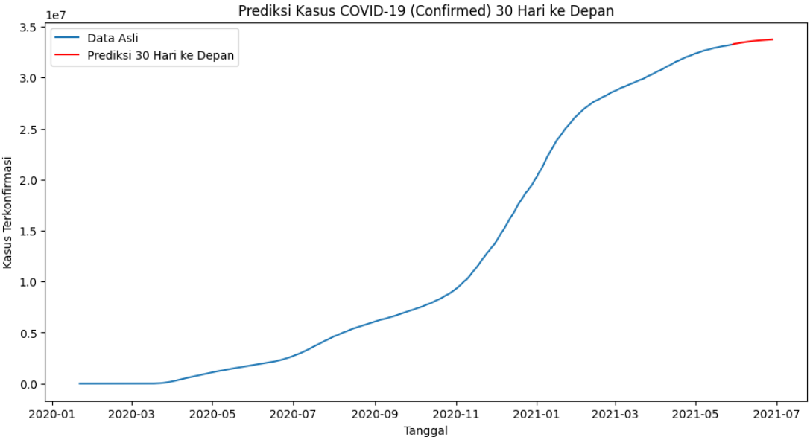

# prediksi-kasus-covid

Proyek ini bertujuan untuk memprediksi jumlah kasus terkonfirmasi COVID-19 di suatu negara menggunakan model **Long Short-Term Memory (LSTM)**. Prediksi dilakukan untuk 30 hari ke depan berdasarkan data historis.

## **Dataset**
Dataset yang digunakan dalam proyek ini adalah **Novel Corona Virus 2019 Dataset** dari Kaggle. Dataset ini berisi informasi tentang kasus COVID-19 di seluruh dunia, termasuk:
- **ObservationDate**: Tanggal observasi.
- **Province/State**: Provinsi atau negara bagian.
- **Country/Region**: Negara atau wilayah.
- **Confirmed**: Jumlah kasus terkonfirmasi.
- **Deaths**: Jumlah kematian.
- **Recovered**: Jumlah kesembuhan.

Link dataset: [Novel Corona Virus 2019 Dataset](https://www.kaggle.com/datasets/sudalairajkumar/novel-corona-virus-2019-dataset)

---

## **Langkah-Langkah yang Dilakukan**
Berikut adalah langkah-langkah yang dilakukan dalam proyek ini:

### 1. **Persiapan Data**
   - Membaca dataset menggunakan `pandas`.
   - Membersihkan data (menghapus kolom yang tidak diperlukan, menangani nilai null, dll).
   - Memfilter data untuk negara tertentu (dalam hal ini, Amerika Serikat).

### 2. **Analisis dan Visualisasi Data**
   - Menampilkan statistik deskriptif.
   - Membuat visualisasi untuk 10 negara dengan kasus tertinggi.
   - Membuat grafik tren kasus COVID-19 di Amerika Serikat.

### 3. **Pemrosesan Data untuk Model**
   - Normalisasi data menggunakan `MinMaxScaler`.
   - Membagi data menjadi training set dan test set.
   - Membuat dataset untuk LSTM dengan time step tertentu (30 hari).

### 4. **Membangun dan Melatih Model LSTM**
   - Membangun model LSTM dengan 2 lapisan LSTM dan 2 lapisan Dense.
   - Melatih model menggunakan data training.

### 5. **Evaluasi Model**
   - Melakukan prediksi pada data training dan testing.
   - Menghitung RMSE untuk mengukur akurasi model.

### 6. **Prediksi 30 Hari ke Depan**
   - Menggunakan model untuk memprediksi kasus terkonfirmasi 30 hari ke depan.
   - Menampilkan hasil prediksi dalam bentuk grafik.

---

## **Hasil**

### 2. **Evaluasi Model**
   - RMSE untuk data testing: 207,802 (untuk data USA).

### 3. **Prediksi 30 Hari ke Depan**

   - Grafik prediksi kasus terkonfirmasi 30 hari ke depan, masih menunjukkan peningkatan kasus meskipun peningkatan sudah tidak signifikan.
